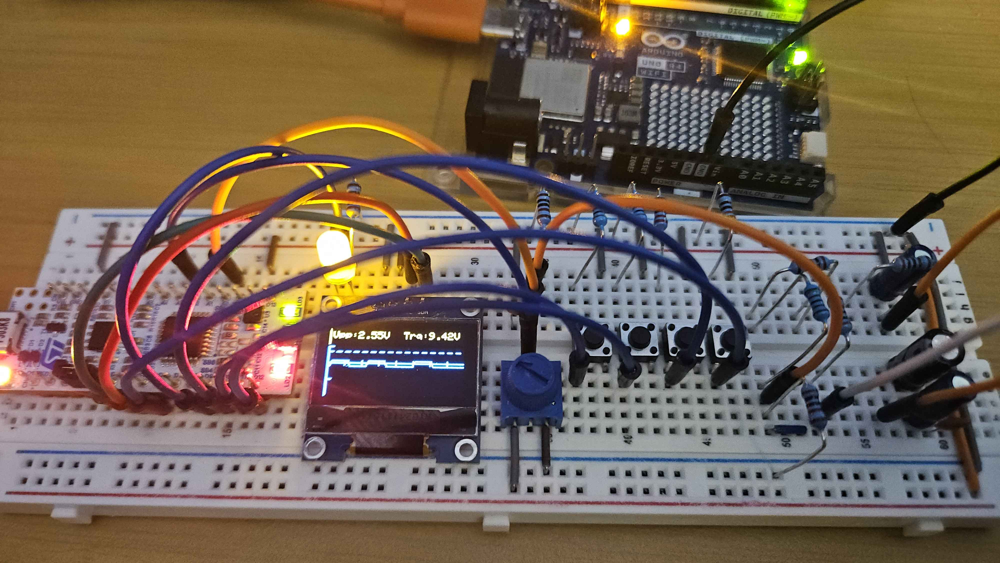

# STM32 Digital Storage Oscilloscope

A simple digital storage oscilloscope (DSO) implementation using STM32F303K8 microcontroller with SSD1306 OLED display.

# Features

- 12-bit ADC for high resolution sampling @ 64 MHz
- Continous Sampling using DMA for real-time waveform display
- Automatic Averaging with 32 consecutive samples averaged per display pixel

## Hardware Components

- MCU: STM32 Nucleo-F303K8 (Nucleo-32 board)
- Display: SSD1306 128x64 OLED (I2C)
- Input stage: 10:1 attenuator with 3.3V DC offset and 1N4728A zener diode
- Control: 4 push buttons & 1 potentiometer
- Status: LED indicators

## Pin Configuration

### ADC Inputs
- PA0: Signal input (after attenuator)
- PA4: Trigger level potentiometer

### I2C (Display)
- PB6: I2C1_SCL
- PB7: I2C1_SDA

### Controls
- PB5 - Run button
- PB4 - Stop button
- PA11 - Single-shot trigger button
- PB1 - Measure mode button (Vpp, Vmin, Vmax)

### Status LEDs
- PB3 - Running indicator (green)
- PA8 - Trigger armed indicator

## Dependencies

- STM32 HAL Library
- [SSD1306 Library](https://github.com/afiskon/stm32-ssd1306): OLED display driver

